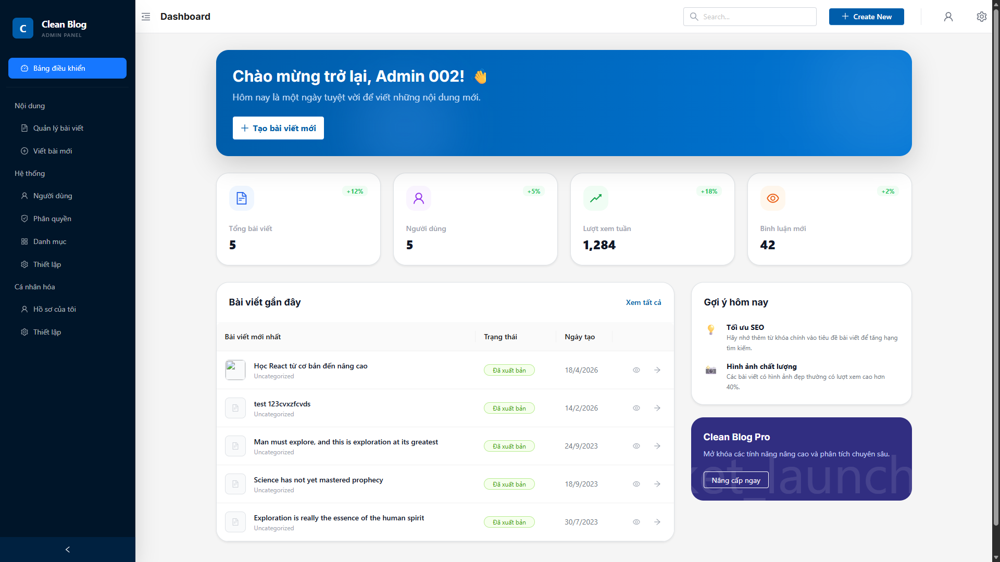
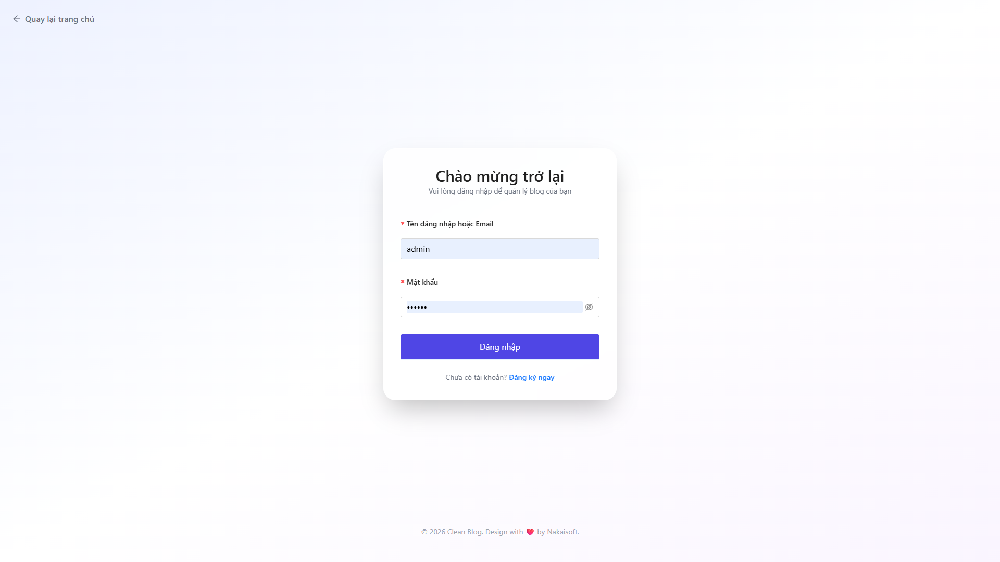
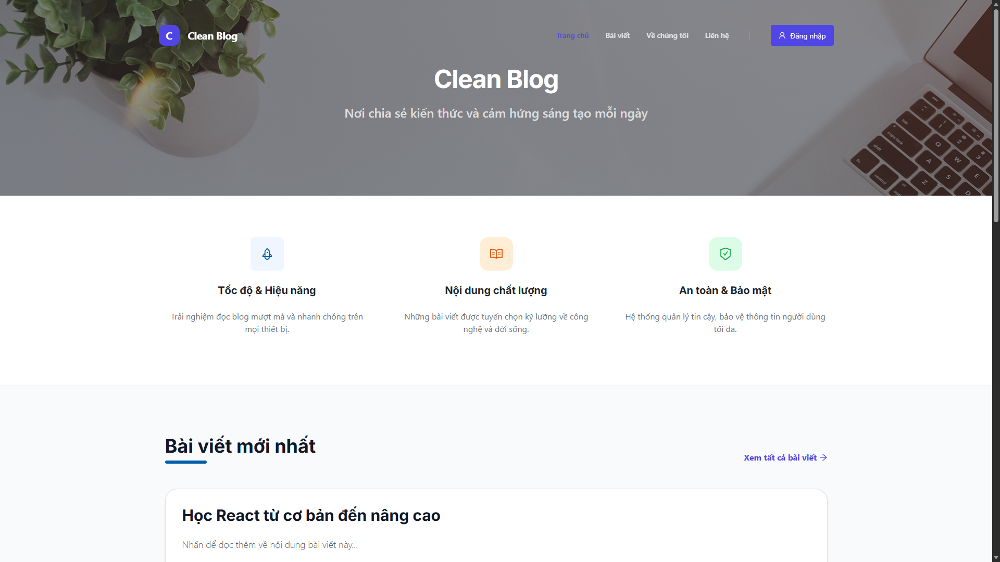

# 🧠 Clean Blog FS

Hệ thống quản lý bài viết **full-stack** với RBAC, danh mục, và tích hợp AI. Tech: NodeJS + Express + MongoDB + ReactJS + Vite.

## 📋 Tổng Quan

| | |
|---|---|
| **Dự án** | Clean Blog FS |
| **Mục tiêu** | Hệ thống quản lý bài viết với phân quyền (RBAC), danh mục và tích hợp AI |
| **Trạng thái** | Phát triển (hoàn xong phân tích & thiết kế) |
| **Tech Stack** | NodeJS + Express + MongoDB + ReactJS + Vite + TypeScript |

**Mục đích học tập:**
- Frontend ↔ Backend ↔ Database workflow
- RESTful API design & implementation
- JWT token authentication
- RBAC (Role-Based Access Control)
- Soft Delete data integrity

## ⚙️ Tech Stack

**Backend:** NodeJS · Express · MongoDB · Mongoose · TypeScript · JWT · Bcrypt

**Frontend:** ReactJS · Vite · TypeScript · TailwindCSS · Ant Design · Fetch API

## 🔑 Chức Năng

- **Xác thực:** Đăng ký/đăng nhập, JWT Bearer Token, RBAC
- **Bài viết:** CRUD, Soft Delete, Slug, Phân trang
- **Danh mục:** CRUD, Liên kết bài viết, Kiểm soát truy cập
- **Người dùng:** Quản lý danh sách, Vai trò & quyền
- **Tìm kiếm:** Filter/Search, Populate dữ liệu, Response chuẩn

## 📂 Cấu Trúc

```
clean-blog-fs/
├── ai-agent/PROJECT_KNOWLEDGE.md      # Kiến thức hệ thống
├── documents/                          # Tài liệu thiết kế
│   ├── 01-project-overview.md
│   ├── 02-requirements.md
│   ├── 03-database-design.md
│   ├── 04-api-design.md
│   ├── 05-ui-structure.md
│   └── 06-system-flow.md
├── backend/                            # API & Database
│   ├── api/v1/                        # Routes & Controllers
│   ├── config/                        # Database, System
│   ├── helpers/                       # Utilities
│   └── index.ts
├── frontend/                           # React UI
│   └── src/
│       ├── pages/                     # Admin, Client, Auth
│       ├── components/                # React Components
│       ├── services/                  # API Services
│       └── utils/
├── stitch_clean_blog_management_system/  # UI Prototypes
└── README.md
```

## 🏛️ Architecture

**Database Collections:**
- Users, Roles, Posts, Categories, Settings

**API Endpoints:**
```
/api/v1/auth/        # Xác thực
/api/v1/posts/       # Bài viết
/api/v1/categories/  # Danh mục
/api/v1/users/       # Người dùng
/api/v1/roles/       # Vai trò
```

**Response Format:**
```json
{
  "code": 200,
  "message": "Success",
  "data": {}
}
```

## 📚 Tài Liệu

**Design Documents** (`/documents`)
- 01: Project Overview - Tầm nhìn & phạm vi
- 02: Requirements - Chức năng & bảo mật
- 03: Database Design - Collection schemas
- 04: API Design - RESTful endpoints
- 05: UI Structure - Pages & layouts
- 06: System Flow - Auth & CRUD workflows

**Resources**
- `/stitch_clean_blog_management_system` - UI Prototypes
- `/ai-agent/PROJECT_KNOWLEDGE.md` - AI Agent Knowledge Base

## 📝 Quy Tắc

**Naming:**
- camelCase (biến/hàm), PascalCase (Component), kebab-case (URL/Slug)

**Bảo mật:**
- Bcrypt password hashing
- JWT Bearer Token authentication
- Authorization header required

**Data Integrity:**
- ⭐ **Soft Delete only** (`deleted: true`)
- No physical deletion
- Full data recovery capability

**API Standard:**
- Response format: `{ code, message, data }`
- Proper HTTP status codes
- Consistent error handling

## 🚀 Workflow

1. **Context** - Đọc `/documents` trước code
2. **Design** - Xác nhận Database (03) & API (04)
3. **Backend First** - API/Model → UI
4. **Verification** - Soft Delete & JWT check

**Glossary:**
- **Soft Delete** - Mark as deleted, not physical removal
- **RBAC** - Role-Based Access Control
- **Slug** - URL-friendly string (e.g., `hoc-javascript-co-ban`)
- **Populate** - Mongoose data joining
- **Bearer Token** - JWT authentication token

## ⚙️ Cài đặt & Chạy dự án

### 1. Cài đặt

1. Mở terminal tại `clean-blog-fs/backend`
   - `npm install`
2. Mở terminal tại `clean-blog-fs/frontend`
   - `npm install`
3. Tạo file `.env` trong thư mục `backend` nếu cần và khai báo các biến môi trường như:
   - `MONGODB_URI`
   - `JWT_SECRET`
   - `PORT`

### 2. Chạy backend

1. `cd clean-blog-fs/backend`
2. `npm start`

Backend sẽ chạy mặc định trên cổng `3002`.

### 3. Chạy frontend

1. `cd clean-blog-fs/frontend`
2. `npm start`

Frontend React sẽ chạy mặc định trên `http://localhost:3000`.

### 4. Lưu ý

- Hãy đảm bảo MongoDB đang chạy trước khi khởi động backend.
- Nếu frontend không kết nối đúng API, kiểm tra cấu hình base URL tới `http://localhost:3002`.

## 📸 Screenshots

### Admin Dashboard

Trang dashboard chính dành cho Admin với thống kê bài viết, người dùng, lượt xem và bình luận.

### Login Page

Trang đăng nhập với form xác thực Email và Password an toàn.

### Home Page

Trang chủ cho người dùng thông thường với danh sách bài viết mới nhất.

---

📅 **Updated:** 25-04-2026